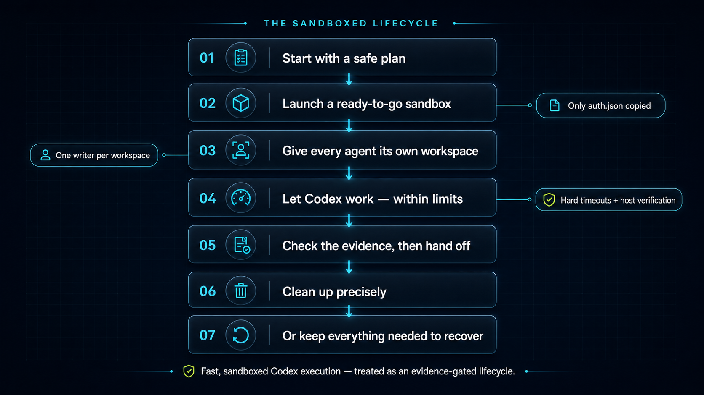

# jinx-agent-skills

This repository provides reusable, evaluated agent skills, with an OpenAI Build Week focus on fast and secure Codex execution inside reusable Docker `sbx` environments.

**Judge one-file entry point:** point a local coding agent at [`OPENAI_BUILD_WEEK.md`](OPENAI_BUILD_WEEK.md). It installs the skill, asks before using a ChatGPT/Codex subscription, and runs either the primary authenticated evaluation or the credential-free mock.

Build Week judges can use the [submission guide](#build-week-submission-guide) to jump directly to the product, contribution, evidence, and quickstart.

## Build Week submission guide

- [Agent setup and evaluation entry point](OPENAI_BUILD_WEEK.md)
- [Proof at a glance](#proof-at-a-glance)
- [The problem](#the-problem)
- [What the project does](#what-the-project-does)
- [Key features](#key-features)
- [OpenAI Build Week contribution](#openai-build-week-contribution)
- [How Codex was used](#how-codex-was-used)
- [How GPT-5.6 was used](#how-gpt-56-was-used)
- [Architecture](#architecture)
- [Judge quickstart](#judge-quickstart)
- [Tests and verification](#tests-and-verification)
- [Limitations and next steps](#limitations-and-next-steps)
- [License and third-party components](#license-and-third-party-components)

## Proof at a glance

| Committed evidence | Result |
| --- | --- |
| Authenticated live boundary matrix | 6/6 across `outer` and `workspace-write` |
| Independent low-effort `gpt-5.6-sol` evaluations | 3/3 final semantic and lifecycle gates |
| Full low-effort fresh-context matrix | 9/9 final gates across three models |
| Credential-leak scan in the fresh-context matrix | 55 generated workspace/artifact files per cell; no copied credential match |
| Secondary credential-free mock regression suite | Passes without consuming a real `sbx` environment, Codex session, or credential |

The public methodology, results, and scorer calibration are in [TESTING.md](TESTING.md), the [evaluation results](evaluation/run-agents-in-sbx/evaluation-results.md), and the [redacted low-effort baseline](evaluation/run-agents-in-sbx/baselines/fresh-context-low-effort-20260720.md).

## The problem

I do substantial local development on my own computer. Coding agents need to install dependencies, execute build tools and package lifecycle hooks, and interact with external libraries. As software supply-chain risk increased, isolating that work from my host became important.

Docker `sbx` supplies fast, reusable development images, but fresh agents repeatedly had to relearn the same workspace, credential, timeout, evidence, and cleanup rules. I also wanted to reuse my ChatGPT/Codex subscription without placing credentials in prompts or mounting my complete host Codex home.

## What the project does

[`run-agents-in-sbx`](skills/run-agents-in-sbx/SKILL.md) packages those rules as an execution lifecycle and evidence system—not merely a prompt or documentation file. Its primary implemented path runs Codex inside `sbx` with file-backed ChatGPT subscription authentication. Its bundled controller and scripts:

- keep sandbox creation, inspection, execution, and cleanup under host control;
- give each writing agent one distinct writable workspace or Git worktree;
- mount optional supporting context read-only;
- enforce hard guest and host timeouts;
- record the effective `sbx` network policy before agent execution;
- copy only file-backed `auth.json` to `/home/agent/.codex/auth.json`;
- never mount host `CODEX_HOME`;
- serialize runs that share the same authentication lineage;
- require a validated, run-specific handoff and durable evidence;
- independently verify the workspace and evidence on the host;
- clean up only the exact sandbox owned by the run;
- stop and preserve state when authentication changes or ownership is ambiguous; and
- keep unknown or untrusted public code in a separate credential-free sandbox.

The repository also retains its earlier evaluated skills:

| Skill | Use it for |
| --- | --- |
| [`run-agents-in-sbx`](skills/run-agents-in-sbx/SKILL.md) | Run Codex implementation tasks in `sbx` with explicit ownership, bounded execution, narrow ChatGPT-subscription authentication, evidence, and recovery. |
| [`kafka-local-lab`](skills/kafka-local-lab/SKILL.md) | Create and smoke-test disposable Docker Compose Kafka labs, from Apache Kafka to Confluent services, Schema Registry, Kafka Connect, and AKHQ. |
| [`kafka-architecture-investigation`](skills/kafka-architecture-investigation/SKILL.md) | Turn Kafka architecture questions into source-backed ADRs, deterministic scenarios, proof harnesses, evidence, reports, and runbooks. |

## Key features

- **Plan mode:** previews the workspace, posture, mounts, credential destination, timeout, artifacts, and cleanup contract without creating a sandbox or copying a credential.
- **Two Codex postures:** `outer` uses the verified `sbx` boundary; `workspace-write` retains Codex's inner workspace sandbox for defense in depth.
- **Typed outcomes:** success, preflight failure, ownership contention, timeout, invalid handoff, changed-auth recovery, cleanup failure, and other lifecycle states are reported distinctly.
- **Conservative recovery:** changed or uncertain authentication stops and preserves the sandbox for manual reconciliation; the runner never logs out automatically or overwrites host auth.
- **One-shot controller:** preflight, locks, sandbox identity, policy capture, optional guest Codex pinning, narrow auth provisioning, bounded execution, evidence capture, validation, and cleanup are one auditable flow.
- **Immutable evaluations:** the fresh-context harness snapshots the skill, runner, fixtures, schema, and scorer once, makes the candidate read-only, and records a content digest before the first cell.
- **Semantic and lifecycle scoring:** model plans are checked against typed safety decisions while runner artifacts independently gate auth stability, handoff validity, and cleanup.
- **Credential-leak scanning:** committed scorers compare generated workspaces and artifacts against copied credential material without publishing the credential or raw transcript.

## OpenAI Build Week contribution

The Git range used for this comparison is the supplied pre-cutoff baseline `db0cb93e47772999396e64a40f22943d898691f4` through the Build Week implementation endpoint `5a41eee817883edc803761f9e45eabe6b5bf7b5d`, the default-branch tip before this README-only submission update.

| Area | Before July 13 | Added July 13–21 | Evidence |
| --- | --- | --- | --- |
| Repository scope | The Kafka skills and exploratory `sbx` notes already existed. | A reusable `run-agents-in-sbx` skill became the Build Week focus; the earlier skills remained intact. | [Kafka lab skill](skills/kafka-local-lab/SKILL.md), [historical `sbx` notes](evaluation/sbx-sandbox-pattern/sbx-skill-notes.md), [new skill](skills/run-agents-in-sbx/SKILL.md) |
| Execution lifecycle | Useful experiments existed, but agents still reconstructed the operating pattern. | Preflight, one-shot runner, bounded-process wrapper, auth provisioner, handoff contract, validator, evidence capture, and exact cleanup. | [Runner scripts](skills/run-agents-in-sbx/scripts), [handoff contract](skills/run-agents-in-sbx/assets/runner-contract.md) |
| Safety and recovery | The notes identified dependency and credential risks. | One-writer worktrees, read-only context, narrow auth copy, auth-lineage locks, hard deadlines, typed outcomes, independent verification, and stop-and-preserve recovery. | [Boundary model](skills/run-agents-in-sbx/references/sandbox-boundaries.md), [operations and recovery](skills/run-agents-in-sbx/references/operations-and-recovery.md) |
| Verification | There was no dedicated release harness for the new lifecycle. | A 6/6 authenticated boundary matrix, a frozen authenticated fresh-context model matrix, and secondary credential-free regression tests for lifecycle logic. | [Evaluation plan](evaluation/run-agents-in-sbx/evaluation-plan.md), [results](evaluation/run-agents-in-sbx/evaluation-results.md), [redacted baseline](evaluation/run-agents-in-sbx/baselines/fresh-context-low-effort-20260720.md) |

The default branch records the Build Week work as a squash commit. The public evaluation record preserves the July 13 fresh-context finding, July 15 live boundary result, and July 20 low-effort release matrix. This project does not claim that the whole repository was created during Build Week.

## How Codex was used

I used Codex to analyze earlier local `sbx` experiments and recurring usage patterns. It accelerated the multi-file implementation of the preflight, runner, bounded-process wrapper, auth provisioner, handoff validator, fixtures, scorers, and documentation. It also helped exercise failure paths and turn observed failures—such as malformed handoff preservation, auth-lock contention, stale ownership metadata, and guest CLI drift—into regression tests.

I made the key decisions about using `sbx`, separating trusted from untrusted workspaces, assigning one writable worktree per agent, copying only the narrow authentication cache, serializing a shared auth lineage, preserving ambiguous state, and keeping privileged host actions outside the agent unless separately authorized.

I used cmux to manage local terminal-agent sessions. cmux helped the development workflow; it is not a runtime dependency of this repository.

## How GPT-5.6 was used

Three independent low-effort `gpt-5.6-sol` sessions evaluated a frozen copy of the skill against a natural mixed-trust planning scenario. The scenario covered concurrent work in a trusted private repository, an unknown public pull request, and an interrupted sandbox with changed guest authentication. GPT-5.6 passed 3/3 final semantic and lifecycle gates.

The complete low-effort matrix—`gpt-5.6-sol`, `gpt-5.5`, and `gpt-5.3-codex-spark`, with three repetitions each—passed 9/9 final gates. Every runner invocation produced a valid handoff, retained unchanged guest auth, and removed its exact sandbox. Each final score scanned 55 generated workspace/artifact files for copied credential material and found no match.

The immutable raw matrix initially scored 8/9. One safe `gpt-5.3-codex-spark` output omitted `codex-logout` from a redundant summary array while its typed recovery fields correctly prohibited logout, host-auth overwrite, and early cleanup. The host-only scorer was corrected without changing the frozen model outputs or relaxing the typed safety invariant. Rescoring produced the final 9/9 result. The [redacted baseline](evaluation/run-agents-in-sbx/baselines/fresh-context-low-effort-20260720.md) contains the complete explanation and per-cell results.

GPT-5.6 evaluated this lifecycle; it did not build the entire repository or make the product and security decisions independently.

## Architecture

[](assets/openai-build-week/sandboxed-lifecycle.png)

Reusable `sbx` images provide fast startup and persistent development tooling. The skill standardizes the ownership, credential, execution, evidence, and recovery lifecycle around those environments; the [boundary model](skills/run-agents-in-sbx/references/sandbox-boundaries.md) documents the exact trust split and controls.

## Judge quickstart

For a guided setup, point a coding agent at [`OPENAI_BUILD_WEEK.md`](OPENAI_BUILD_WEEK.md). It checks prerequisites, requests separate authorization for host installation and subscription use, installs the skill without overwriting an existing copy, and selects the live or mock route with the judge.

The main path runs a real Codex session inside Docker `sbx` using file-backed ChatGPT subscription authentication. It requires a macOS host with Git, Bash, Python 3, Docker `sbx`, Codex CLI, and a ChatGPT login. `sbx` guests are Linux and may use a different architecture from the host; the recorded project evidence does not claim a broader host-platform matrix.

### Clone and install the skill

```bash
git clone https://github.com/DavidNavalho/jinx-agent-skills.git
cd jinx-agent-skills

git --version
bash --version
python3 --version

mkdir -p "$HOME/.codex/skills"
cp -R skills/run-agents-in-sbx "$HOME/.codex/skills/"
```

### Prepare the authenticated runtime

On macOS:

1. Install [Homebrew](https://brew.sh/) if it is not already present, reviewing and explicitly authorizing the host installation.
2. Follow [Docker's official `sbx` installation guide](https://docs.docker.com/ai/sandboxes/):

   ```bash
   brew trust docker/tap
   brew install docker/tap/sbx
   sbx login
   ```

3. Install Codex CLI and sign in with ChatGPT so the host has a file-backed subscription login.
4. Run the skill's credential-safe preflight before authenticated execution:

   ```bash
   skills/run-agents-in-sbx/scripts/preflight.sh \
     --workspace "$(pwd)"
   ```

If an agent performs this setup, point it at this section and explicitly authorize each host installation. It should stop before inspecting credential contents or starting an authenticated run without approval.

### Run the authenticated evaluation

The committed live harness uses generated trusted fixtures. Preview the credential crossing and lifecycle first; plan mode does not create a sandbox or copy credentials:

```bash
evaluation/run-agents-in-sbx/run-live-boundary-eval.sh --plan
```

After reviewing that plan, explicitly authorize the authenticated run:

```bash
ALLOW_REAL_CODEX_AUTH=1 \
evaluation/run-agents-in-sbx/run-live-boundary-eval.sh \
  --repetitions 3
```

Never mount host `CODEX_HOME`. The implemented provider copies only the required file-backed cache and is restricted to trusted private code.

### Secondary: credential-free mock regression

The repository also provides a five-minute regression check for reviewers who cannot or should not provide subscription authentication. It uses committed mock `sbx` and Codex fixtures to exercise lifecycle control, recovery, handoff, scoring, and cleanup logic. It does not prove the real `sbx` boundary; that evidence comes from the authenticated live matrix above.

```bash
evaluation/run-agents-in-sbx/run-static-tests.sh
```

Expected final line:

```text
run-agents-in-sbx static tests passed
```

The mock suite creates temporary data under the host temporary directory and removes it through its exit trap. It does not read a real credential, create a real sandbox, or run an authenticated model evaluation.

## Tests and verification

| Layer | Committed result | Recorded tools/models |
| --- | --- | --- |
| Authenticated live boundary matrix | 6/6 | `sbx v0.35.0`, `codex-cli 0.144.4`, `gpt-5.4-mini`, low effort; 3 `outer` and 3 `workspace-write` runs |
| GPT-5.6 fresh-context evaluation | 3/3 final | `gpt-5.6-sol`, low effort |
| Full fresh-context matrix | 9/9 final | `gpt-5.6-sol`, `gpt-5.5`, `gpt-5.3-codex-spark`; low effort; host `codex-cli 0.144.5`, guest `0.145.0-alpha.13` |
| Secondary deterministic/mock suite | Passed | Mock `sbx` and Codex fixtures; no real credential |

Important limits:

- The live boundary run observed a permissive `default-allow-all` policy. It proves filesystem and lifecycle boundaries, not restrictive egress.
- Real token refresh, cancellation, authentication ambiguity, and cleanup failure remain mock-tested where deliberately inducing them could create a credential-recovery incident.
- The model matrix is a finite low-effort sample and has no no-skill control. It is release evidence for those cells, not a guarantee for every model or a causal measure of skill uplift.

See the [evaluation plan](evaluation/run-agents-in-sbx/evaluation-plan.md), [detailed results](evaluation/run-agents-in-sbx/evaluation-results.md), and [testing index](TESTING.md) for reproduction commands and coverage.

## Limitations and next steps

- Copied ChatGPT-subscription auth is only for trusted private workspaces; unknown or adversarial code must run credential-free.
- Network-policy visibility is implemented, but restrictive egress was not proven by the recorded run.
- Claude subscription, Claude API, OpenAI API-key authentication, and other agent/provider paths are not implemented.
- Safe automated reconciliation of refreshed guest authentication remains future work.
- Future work includes reusable project images, clearer evidence reporting, deeper recovery diagnostics, wider host/model coverage, restrictive egress verification, and a no-skill control.

## License and third-party components

This repository is [MIT licensed](LICENSE).

It uses Docker `sbx`, Codex CLI, ChatGPT subscription authentication, Bash, Python, Git, JSON, and JSON Schema. The implemented authenticated provider path is Codex CLI with file-backed ChatGPT subscription auth; it is not the OpenAI API. Users are responsible for complying with all applicable third-party terms and licenses.
